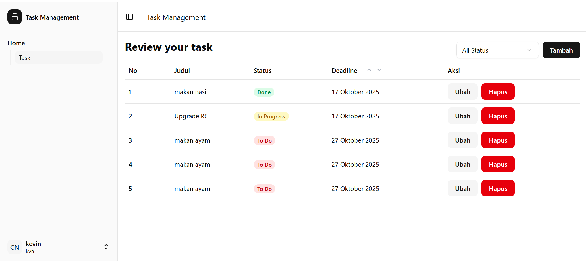

# Task Management System

## Deskripsi Singkat Aplikasi

Aplikasi Task Management System adalah sebuah platform untuk mengelola tugas (tasks) secara
terpusat. Aplikasi ini dikembangkan dengan arsitektur Monorepo yang memisahkan backend (API) dan
frontend (antarmuka pengguna).

Fitur utama meliputi:

- Autentikasi: Register dan Login berbasis JWT.
- Manajemen Tugas: Membuat, Melihat Detail, Mengubah, dan Menghapus tugas.
- Sorting & Filtering: Filter tugas berdasarkan status (TODO, IN_PROGRESS, DONE) dan sorting
  berdasarkan deadline.
- Akses Tugas: Setiap pengguna hanya dapat melihat tugas yang mereka buat (creator) atau tugas yang
  ditugaskan kepada mereka (user).

## Teknologi yang Digunakan

| **Komponen**            | **Teknologi Utama**            | **Detail Penting**                                                             |     |     |
| ----------------------- | ------------------------------ | ------------------------------------------------------------------------------ | --- | --- |
| Backend (API)           | NestJS (Node.js Framework)     | Menggunakan arsitektur modular dan TypeScript.                                 |     |     |
| Database                | PostgreSQL                     | Dihubungkan melalui TypeORM.                                                   |     |     |
| Otentikasi              | JWT (JSON Web Tokens) & Bcrypt | Implementasi AuthGuard dan JwtService untuk melindungi endpoint.               |     |     |
| Validasi                | Class-Validator                | Digunakan secara global melalui ValidationPipe untuk validasi DTO.             |     |     |
| Frontend (UI)           | React                          | Menggunakan React v19.x terbaru.                                               |     |     |
| Routing & Data Fetching | React Router                   | Menggunakan Loaders dan Actions untuk fetching dan modifikasi data deklaratif. |     |     |
| Styling & UI Library    | Tailwind CSS & Shadcn/ui       | Menggunakan komponen UI modern.                                                |     |     |

## Langkah Menjalankan Backend & Frontend

Pastikan Anda memiliki Node.js (disarankan v18+) dan PostgreSQL terinstal.

### Setup Backend

1. Instal Dependensi:

   ```bash
   cd backend
   pnpm install

   ```

2. Konfigurasi Environment: Buat file .env di direktori backend berdasarkan .env.example.

   ```.env
   DB_HOST=localhost
   DB_PORT=5432
   DB_USER=your_user
   DB_PASSWORD=your_password
   DB_DATABASE=task-management

   JWT_TOKEN=YOUR_SECRET_KEY
   ```

3. Jalankan Aplikasi, server akan berjalan di port 3000

   ```bash
   pnpm  start:dev

   ```

### Setup Frontend

1. Instal Dependensi:

   ```bash
   cd frontend
   pnpm install

   ```

2. Konfigurasi Environment: Buat file .env di direktori frontend berdasarkan .env.example.

   ```.env
   VITE_API_BASE_URL=http://localhost:3000
   ```

3. Jalankan Aplikasi (Development), aplikasi berjalan pada port 5173:

   ```bash
   pnpm  dev

   ```

## Informasi Login Dummy

Anda dapat membuat akun pertama dengan melakukan register atau menggunakan informasi login berikut

```
{
  "username": "mily",
  "password": "mainpubg"
}
```

## Struktur Database (Entity)

Aplikasi menggunakan dua entitas utama (User dan Task) yang saling berelasi di PostgreSQL.

### User

| **Kolom** | **Tipe Data**     | **Deskripsi**                                         |
| --------- | ----------------- | ----------------------------------------------------- |
| user_id   | int4              | Primary Key, Auto-generated.                          |
| name      | character varying | Nama lengkap pengguna.                                |
| username  | character varying | Nama pengguna unik.                                   |
| password  | character varying | Hash kata sandi (kolom disembunyikan secara default). |

### Task

| **Kolom**   | **Tipe Data**                       | **Deskripsi**                             |
| ----------- | ----------------------------------- | ----------------------------------------- |
| task_id     | int4                                | Primary Key, Auto-generated.              |
| title       | character varying                   | Judul task.                               |
| description | character varying                   | Deskripsi task.                           |
| status      | ENUM('TODO', 'IN_PROGRESS', 'DONE') | Status task.                              |
| deadline    | date                                | Tanggal deadline task                     |
| user_id     | int4                                | Foreign Key ke user sebagai pelaksana.    |
| created_by  | int4                                | Foreign Key ke user sebagai pembuat task. |

## Screenshot Tampilan Utama

Halaman yang ditampilkan merupakan halaman CRUD Task


